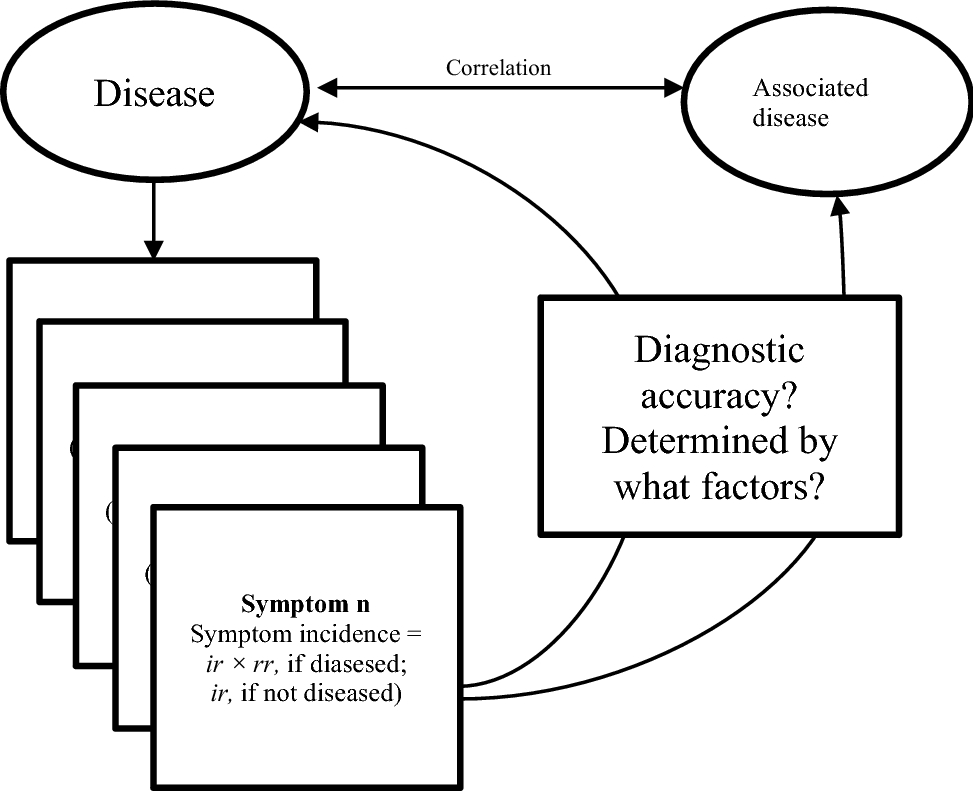

# Correlated-Disease-Prediction

## Useful Insights from our Data
- People in old ages have a higher probability of being tested positive for diseases which is an outlier for our dataset.
- If the age is greater than 80, the disease is likely to be a stroke.This observation aligns with the general understanding that the risk of stroke increases with age.
- Migraine and Hypertension are not present in ages between 20 and 30. This absence suggests that these conditions may be more prevalent in older age groups.
- Hypertension and Osteoporosis appear more frequently as the age increases, indicating a potential correlation between these diseases and age.
- A person with low blood pressure does not have a stroke. This could be a crucial factor in stroke prediction.
- Fatigue, cholesterol level, and blood pressure are the features that show the most variation among different values. These could potentially be strong predictors in our model.
- Prediction and Correlations are subject to F1 score and we also used Fine Tunning.

Greetings! We'll use common health signs to forecast illnesses in this project. Our goal is to develop a model that can precisely detect diseases based on fundamental symptoms and health indicators using the Disease Symptoms and Patient Profile Dataset.

This project will provide us a thorough overview of how to forecast illnesses based on fundamental medical data and also we will see how the fundamental diseases are correlated.
